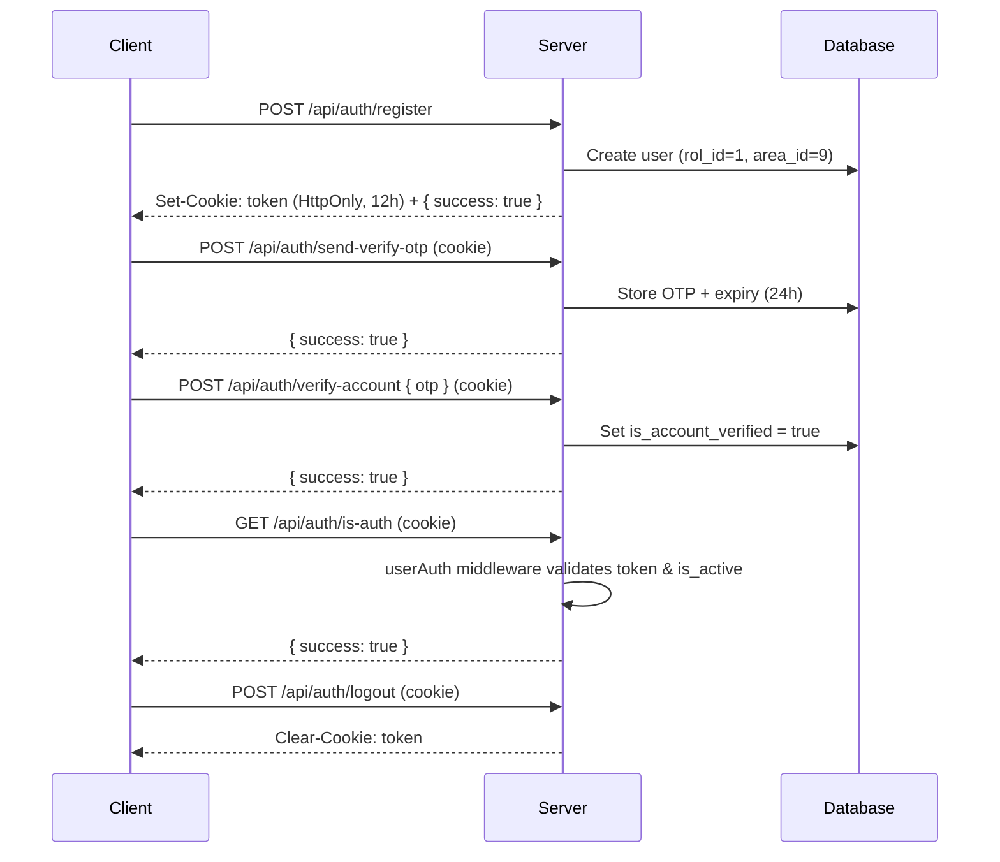

QuickFind uses a **cookie-based JWT** strategy. After a successful register or login, the server sets an HttpOnly cookie named `token`. All subsequent requests to protected endpoints automatically include this cookie — no `Authorization` header is needed.

## Authentication lifecycle

<Steps>
  <Step title="Register">
    A new user submits their details to `POST /api/auth/register`. The server creates the account, issues a 12-hour JWT, and sets the `token` cookie.
  </Step>
  <Step title="Email verification">
    While authenticated, the user calls `POST /api/auth/send-verify-otp` to receive a 6-digit OTP by email, then submits it to `POST /api/auth/verify-account`. Verification is required before password reset is available.
  </Step>
  <Step title="Login">
    An existing user calls `POST /api/auth/login` with their email and password. On success, a fresh 12-hour `token` cookie is issued and the user's `rol_id` is returned.
  </Step>
  <Step title="Protected requests">
    Every request to a protected endpoint passes through the `userAuth` middleware. The middleware reads the cookie, verifies the JWT, and checks the user's `is_active` flag in the database before forwarding the request.
  </Step>
  <Step title="Logout">
    `POST /api/auth/logout` clears the `token` cookie server-side.
  </Step>
</Steps>

## JWT token

The token is a signed JWT with the following characteristics:

| Property | Value |
|---|---|
| Signing secret | `JWT_SECRET` environment variable |
| Expiry | 12 hours |
| Cookie name | `token` |
| Cookie flags | `HttpOnly`, `Secure` (production only) |
| `sameSite` | `none` in production, `strict` in development |
| Token payload | `{ id: user.id, role: user.rol_id }` |

The `token` cookie is set on both register **and** login, so clients receive a valid session immediately after account creation.

## The `userAuth` middleware

Every protected route passes through `userAuth` before reaching its handler. The middleware performs three checks in order:

1. **Cookie present** — if `req.cookies.token` is missing, returns `401 { success: false, message: 'Not Authorized. Login Again' }`.
2. **Token valid & not expired** — verifies the JWT signature against `JWT_SECRET`. If the token has expired, the cookie is cleared and the response is `401 { success: false, message: 'SESSION_EXPIRED' }`.
3. **Account active** — looks up the user in the database and checks `is_active`. If the account has been disabled, the cookie is cleared and the response is `403 { success: false, message: 'ACCOUNT_DISABLED_FORCE_LOGOUT' }`.

On success, the middleware attaches `req.userID` (numeric) and `req.userRole` to the request object.

## The `is_active` flag and forced logout

Administrators can disable a user account at any time by setting `is_active = false` in the database. Because `userAuth` performs a **live database check on every request**, a disabled user is logged out immediately — even if their JWT has not yet expired. The client receives `ACCOUNT_DISABLED_FORCE_LOGOUT` and the cookie is cleared automatically.

<Note>
  Browser clients must send `withCredentials: true` (Axios / Fetch) so that the `token` cookie is included in cross-origin requests. Without this flag, protected endpoints will always return `Not Authorized. Login Again`.
</Note>

## Protected vs public endpoints

| Method | Path | Auth required |
|---|---|---|
| POST | `/api/auth/register` | No |
| POST | `/api/auth/login` | No |
| POST | `/api/auth/logout` | No |
| POST | `/api/auth/send-verify-otp` | Yes (`userAuth`) |
| POST | `/api/auth/verify-account` | Yes (`userAuth`) |
| GET | `/api/auth/is-auth` | Yes (`userAuth`) |
| POST | `/api/auth/send-reset-otp` | No |
| POST | `/api/auth/reset-password` | No |
